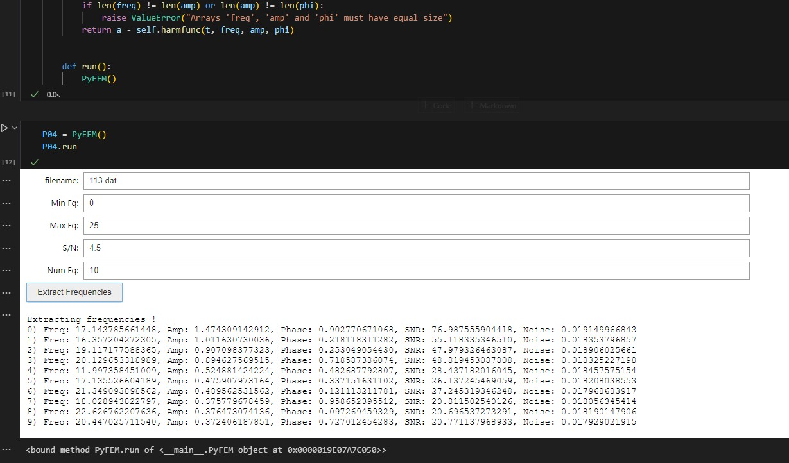

# PyFEM - Python Frequency Extraction Module

PyFEM is a Python-based module designed for extracting frequencies from time-series data. It features an interactive Jupyter Notebook interface using `ipywidgets` that makes it simple to load data, run frequency analysis, and extract significant harmonic modes.

## Features

- **Interactive GUI:** Easy-to-use widgets to set parameters (min/max frequency, S/N ratio, number of frequencies, and input file name).
- **Frequency Analysis:** Uses periodogram analysis (Fast Amplitude Spectrum - FASPER) to identify peaks in the frequency domain.
- **Pre-whitening Algorithm:** Iteratively finds the highest peak, fits a harmonic function (amplitude and phase) to the time-series using least-squares optimization, and pre-whitens the data by subtracting the fitted model.
- **Output:** Saves the extracted frequency parameters (frequency, amplitude, phase, signal-to-noise ratio, and local noise level) to a file (`pw_data.pw`).

## Requirements

The module relies on the following standard Python libraries for scientific computing:
- `numpy`
- `scipy` (specifically `optimize.leastsq` and `fftpack.ifft`)
- `ipywidgets`
- `IPython.display`

## How to Use

1. Open the `pyfem.ipynb` notebook in Jupyter Notebook or JupyterLab.
2. Run the cells to initialize the `PyFEM` class.
3. Use the generated interactive UI to input your parameters:
   - **Min Fq:** Minimum frequency to search.
   - **Max Fq:** Maximum frequency to search.
   - **S/N:** Signal-to-noise ratio threshold.
   - **Num Fq:** Maximum number of frequencies to extract.
   - **filename:** The name of your input data file (e.g., `113.dat`). The data file should contain two columns: time and amplitude.
4. Click the **Extract Frequencies** button.
5. Check the `pw_data.pw` file for the output data.

## Output Format (`pw_data.pw`)

The output file contains 5 columns formatting with `%12.12f`:
1. Extracted Frequency
2. Amplitude
3. Phase
4. Signal-to-Noise Ratio (SNR)
5. Local Noise Level